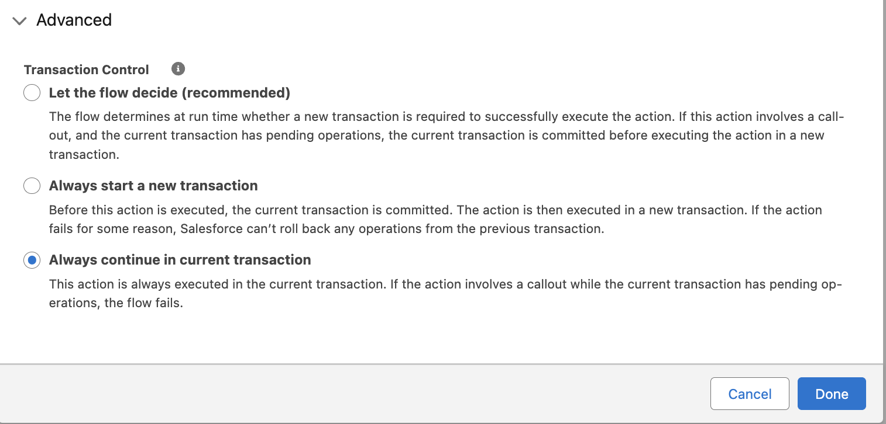
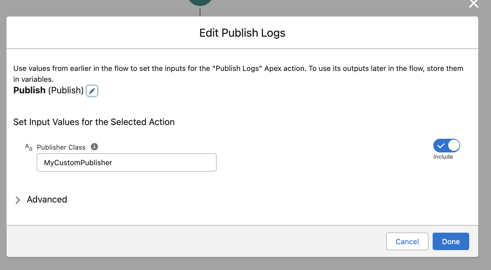

# apex-logger

A straightforward logging utility for Apex, Flows, and Lightning Components. With its simplified interface, `apex-logger` streamlines the process of tracking crucial information, enabling developers to focus on what truly matters: crafting exceptional Salesforce solutions.

## Usage

Logging with `apex-logger` is a two-step process:

1. **Generate Logs**. Log information from Apex, Flows, or Lightning Components. All logs are held in a static variable until published, or until the transaction concludes.
2. **Publish Logs**: Commit any "pending" logs to the database as `Log__c` records. Any unpublished logs at the end of the transaction will be lost.

You can leverage this framework to generate Log messages from anywhere in Salesforce, including Apex, Flows, and Lightning Components.

### Logging From Apex

In Apex, use the `Logger` class to construct, log, and publish Log messages. Logs are stored statically, across all instances of the `Logger` class.

#### Generate Logs

Use the `log()` method to generate Log messages:

```java
Logger myLogger = new Logger().log(System.LoggingLevel.ERROR, 'Hello world!');
```

You can also use level-specific overloads as shorthand:

```java
// In order of most to least severe:
new Logger().error('Hello world!');
new Logger().warn('Hello world!');
new Logger().info('Hello world!');
new Logger().debug('Hello world!');
new Logger().fine('Hello world!');
new Logger().finer('Hello world!');
new Logger().finest('Hello world!');
```

#### Optional: Add Additional Context

The `Logger` class also provides methods used to add additional context to Logs:

-   `setCategory__c(String)`: Sets the `Category__c` field. This can be used to categorize your Log messages in a way that's meaningful to your organization. For example, this could be the name of a managed package, or the business division that the code is running in.
-   `setLoggedFrom(Type/String)`: Sets the `LoggedFrom__c` field. In Apex, this should be the current Apex Class.
-   `setRelatedRecordId(SObject/Id)`: Sets the `RelatedRecordId__c` field, which allows the Log to be displayed on that record page if desired.

```java
Logger myLogger = new Logger()
	.setCategory('apex-logger')
    .setLoggedFrom(MyClass.class)
    .setRelatedRecordId(account.Id);
// All of these logs will use the context generated above
for (Integer i = 0; i < 200; i++) {
    myLogger.finest('Log #' + i);
}
// ...but this one won't!
new Logger().finest('Done logging');
```

#### Publish Logs

Once logs are generated, they will not be inserted until the `publish()` method is called:

```java
new Logger().finest('Hello world').publish();
```

Publishing behavior is governed by the `Logger.LogPublisher` interface. Read more about this interface [here](#the-loggerlogpublisher-interface).

By default, `Logger` will use the `Logger.LogPublisher` defined in the current user's `LogSetting__c.Publisher__c` field to publish the Logs. If no publisher is defined, the default behavior is for Logs to be inserted via a traditional `insert` DML statement.

You can define your own `Logger.LogPublisher` and use this method to override the user's specified `Publisher__c`:

```java
new Logger().finest('Hello world');
Logger.LogPublisher publisher = MyCustomPublisher();
// The Logger will use this publisher to publish the pending log(s)
new Logger().publish(publisher);
```

### Logging From Flows

To log from flow, use the included `Log` and `Publish Logs` invocable actions. Both actions allow the use of flow variable notation to insert variables from your flow in the log body or other fields. For example, `{!myVar}`.

> **IMPORTANT**: Screen Flows give users the option to select whether to execute the transaction in the current, or new transaction. Because the Logger framework is only aware of Logs made in the current transaction, it's important that you select the **Always continue in current transaction** option, when provided the choice.



#### The `Log` Invocable Action (`InvocableLogger`)


Generates a Log message, and stores it in memory. To insert the log, call the `Publish Logs` invocable action afterwards.

#### The `Publish Logs` Invocable Action (`InvocableLogPublisher`)


Publishes any pending Logs, via a `publish()` call. 

You may optionally specify the name of a `Logger.LogPublisher` class to handle custom publishing behavior. If no value is specified, the default publisher will be used instead. 

### Logging From Lightning Components

You can use this framework to log directly from custom LWCs. Simply import the `LwcLogger.log` module:

```js
import doLog from "@salesforce/apex/LwcLogger.log";
```

This method expects a serialized `LogInput` object, consisting of the following parameters:

```js
let logInput = {
	body: "Hello world!",
	level: "FINEST",
	// The rest are all optional
	category: "my-package",
	loggedFrom: "my-lwc",
	relatedRecordId: this.recordId
};
doLog({ payload: JSON.stringify(logInput) });
```

Since each Apex call from LWC is its own discrete transaction, the `LwcLogger.log()` method handles both logging & publishing. It's not possible to specify the `LogPublisher` from this method.

### The `Log__c` Object

Log details are stored in the `Log__c` custom object. Read more about this object and its fields [**here**](/docs/LOGOBJECT.md).


You can view Logs in the UI via the `Logs` tab:


You can also view logs related to a specific record via the `Related Logs` lightning component:


### The `LogSetting__c` Custom Settings Object


`LogSetting__c` is a custom settings object used to control log enablement, publishing behavior, and more. Specify a Log Setting record to determine how the Logger will run across your org, or for specific Users & Profiles.

### The `Logger.LogPublisher` Interface

The Logger uses a `LogPublisher` interface to define the logic for publishing logs. `apex-logger` ships with a built in publisher - `LogDmlPublisher`. This class inserts logs using traditional DML.

You can also define your own publishing logic by creating a class which implements this interface and its `publish()` method:

```java
void publish(List<Log__c> logs);
```

You can specify which publisher to use via the `publish(Logger.LogPublisher)` method:

```java
Logger.LogPublisher pub = new MyPublisher();
new Logger().finest('Hello world!').publish(pub);
```

You can also specify a User's default Publisher class via the `LogSetting__c.Publisher__c` field:


```java
// Since a LogSetting__c.Publisher__c is defined, will use MyProcessor by default
new Logger().finest('Hello world!').publish();
```

## Getting Started

### Installation

`apex-logger` is available as an unlocked package. Before installing the logger package, install the [`lwc-related-list`](https://github.com/jasonsiders/lwc-related-list) package. Run this command:

```sh
sf package install -p 04tDn0000011NQzIAM -w 5
```

Once installed, you are ready to install the logger package. Obtain the latest package version id (starting with `04t`) via the [Releases](https://github.com/jasonsiders/apex-logger/releases/latest) tab. Run this command to install the package to your environment. Replace 04t... with your desired package version Id:

```sh
sf package install -p 04t... -w 3
```

### Setup

To auto-generate Log Settings for yourself and standard system users (like `Automated Process`), as well as provision yourself the necessary permissions to view Log records, run the [`quickstart.sh`](/scipts/quickstart.sh) script in your terminal.

#### Log Settings

You can modify or manually create `LogSetting__c` records in the UI, via _Setup > Custom Settings > Log Settings > Manage_.

#### Permissions

The `LogAccess` and `LogFromLightning` permission sets can be assigned in the UI via _Setup > Permission Sets_.

Users do not need to have any permissions to the Logger in order to use it. However, users do need access to the `Log__c` object and its fields in order to view log records in the UI. The `LogAccess` permission set can be used to provision this access.

The `LogFromLightning` permission set gives access to the `LwcLogger` class. This should be assigned to any users who might interact with Lightning Components that leverage the Logging framework.
