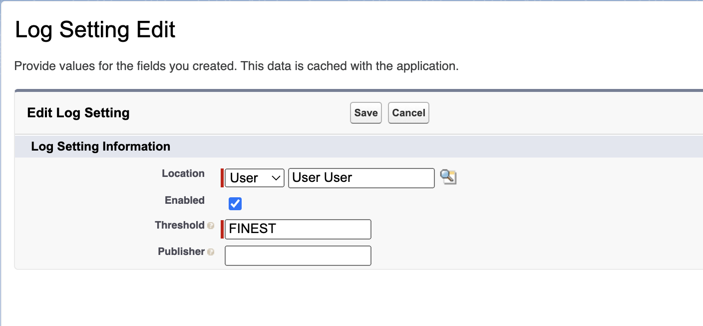
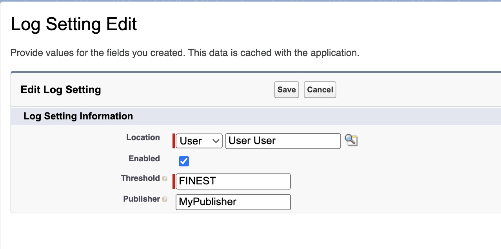

# apex-logger
TODO!

## Getting Started

### Installation

`apex-logger` is available as an unlocked package. Before installing the logger package, you must install the [`lwc-related-list`](https://github.com/jasonsiders/lwc-related-list) package. Run this command:
```
sfdx package install -p 04tDn0000011NQzIAM -w 5
```

Once installed, you are ready to install the logger package. Obtain the latest package version id (starting with `04t`) via the [Releases](https://github.com/jasonsiders/apex-logger/releases/latest) tab. Run this command to install the package to your environment. Replace 04t... with your desired package version Id:
```
sf package install -p 04t... -w 3
```

### Configuration
To begin logging, you will need to create `LogSetting__c` records. You can do this in the UI, via _Setup > Custom Settings > Log Settings > Manage_. 

Alternatively, you can run the included [setup script](scripts/shell/setup.sh). This will create Log Setting records for the org, system users that can't normally be accessed via the UI (like `Automated Process`), and yourself. 

### Permissions
Users do not need to have permissions to the Logger in order to use it. However, users do need access to the `Log__c` object and its fields in order to view log records in the UI. Use the `LogAccess` permission set to provision this access.

If you choose to Log from Lightning Components, you will need to ensure that any users who interact with your component have access to the `LwcLogger` apex class. Use the `LogFromLightning` permission set to provision this access. 
## Usage
### Logging
Logging requires a two-step process:

1. **Generate Logs**. The `log()` method(s) - and equivalent Flow and Lightning Component functions generate content to be captured in `Log__c` records. All logs generated throughout a transaction are held in a static variable until published, or until the transaction concludes. 
2. **Publish Logs**: The `publish()` method commits any pending logs generated to the database, in the `Log__c` SObject. Any unpublished logs at the end of the transaction will be lost. Since this will typically incur a DML statement, publish Logs sparingly, and never include `publish()` calls inside of a loop. 

You can leverage this framework to generate Log messages from anywhere in Salesforce, including Apex, Flows, and Lightning Components:

#### From Apex
In Apex, use the `Logger` class to construct, log, and publish Log messages. All methods return a `Logger` instance, and can be chained together. You do not need to use the same `Logger` instance each time, since the instance references static variables shared across all instances.

Use the `log()` method to generate Log messages. The `log()` method accepts the following parameters:
- A [`System.LoggingLevel`](https://developer.salesforce.com/docs/atlas.en-us.apexref.meta/apexref/apex_enum_System_LoggingLevel.htm) value which indicates the severity of the message. Works in tandem with [Log Settings](#the-logsetting__c-custom-settings-object), to determine if the message should actually be logged.
- An `Object` representing to the Log Message. The `String.valueOf` this parameter is stored in the `Body__c` field. 
```
Logger myLogger = new Logger().log(System.LoggingLevel.ERROR, 'Hello world!');
```

You can also use overloads which set the `System.LoggingLevel` to the value matching the method name:
```
// In order of most to least severe:
new Logger().error('Hello world!');
new Logger().warn('Hello world!');
new Logger().info('Hello world!');
new Logger().debug('Hello world!');
new Logger().fine('Hello world!');
new Logger().finer('Hello world!');
new Logger().finest('Hello world!');
```

Once logs have been generated, you can insert them into the database via the `publish()` method. This typically incurs a DML statement, unless there are no logs to insert.
```
new Logger().finest('Hello world').publish();
```
Publishing behavior is governed by the `Logger.LogPublisher` interface. Read more about this interface [here](#the-loggerlogpublisher-interface).

By default, `Logger` will use the `Logger.LogPublisher` defined in the current user's `LogSetting__c.Publisher__c` field to handle publishing behavior. If no publisher is defined, the default behavior is for Logs to be inserted via a traditional `insert` DML statement. 

If you wish, you can define your own `Logger.LogPublisher` and use this method to override the user's specified `Publisher__c`:
```
new Logger().finest('Hello world');
Logger.LogPublisher publisher = MyCustomPublisher();
// Pass the publisher as an argument to the publish method.
// The Logger will use this publisher to publish the pending log(s)
new Logger().publish(publisher);
``` 
The `Logger` class also provides a number of methods that allow you to add additional context to your Log messages:
- `setLoggedFrom(Type/String)`: Sets the `LoggedFrom__c` field. In Apex, It's reccommended to list the name of the current Apex Class.
- `setRelatedRecordId(SObject/Id)`: Sets the `RelatedRecordId__c` field, which represents a closely-related record. 
- `setSource(String)`: Sets the `Source__c` field. This can be used to specify more broadly what generated the Log message. For example, the name of your managed package, or the business division. 

These values are stored on the `Logger` object and will apply to any logs that the specific object is used to generate:
```
Logger myLogger = new Logger()
    .setLoggedFrom(MyClass.class)
    .setRelatedRecordId(account.Id)
    .setSource('apex-logger');
// All of these logs will use the context generated above
for (Integer i = 0; i < 200; i++) {
    myLogger.finest('Log #' + i);
}
// ...but this one won't!
new Logger().finest('Done logging');
```

#### From Flow
TODO!

#### From Lightning Components
TODO!

### The `Log__c` Object


Log details are stored in the `Log__c` custom object. The object contains these fields:
- **Body**: Displays the Log message.
- **Context**: The [`System.Quiddity`](https://developer.salesforce.com/docs/atlas.en-us.apexref.meta/apexref/apex_enum_System_Quiddity.htm) of the current transaction. Ex., `ANONYMOUS`.
- **Level**: Displays the severity of the Log, expressed as a [`System.LoggingLevel`](https://developer.salesforce.com/docs/atlas.en-us.apexref.meta/apexref/apex_enum_System_LoggingLevel.htm). Ex., `FINEST`.
- **Logged At**: The Date/Time that the `log()` method was called. This may differ slightly from the `CreatedDate`. 
- **Logged By**: The User who called the `log()` method. This may differ from the `CreatedById`, depending on the publishing method used.
- **Logged From**: (Optional) Displays the name of the Apex Class, Flow, or Lightning Component which generated the Log, if provided.
- **Ordinal**: Indicates the Log's index relative to other logs made in the same transaction. The first Log has an Ordinal of `1`, then `2`, `3`, and so on.
- **Related Record**: (Optional) The Salesforce Id of a record deemed to be closely related to the Log, if provided.
- **Source**: (Optional) Displays the package, division, or other user-defined "Source" of the Log.
- **Stack Trace**: A stack trace string describing where the Log was generated.
    > Note: This field will always be null when run in a managed package context. If using in a managed package, you can use `LoggedFrom__c` / `setLoggedFrom()` to provide at least some context.
- **Transaction**: The [unique Id](https://developer.salesforce.com/docs/atlas.en-us.apexref.meta/apexref/apex_class_System_Request.htm#apex_System_Request_getRequestId) of the Apex transaction that generated the Log. 

You can view Logs in the UI via the `Logs` tab:
 

You can also view logs related to a specific record via the `Related Logs` lightning component:
 

 

### The `LogSetting__c` Custom Settings Object
`LogSetting__c` is a custom settings object used to control log enablement. Because this is a [Hierarchy Custom Settings](https://developer.salesforce.com/docs/atlas.en-us.apexcode.meta/apexcode/apex_customsettings.htm) object, you have fine control over settings ranging from the whole organization, to profiles, to specific users. 

At the beginning of each transaction, the framework will find the Log Setting record that matches their User. If one doesn't exist, it will find one based on their profile. If one doesn't exist, it will return the Organization-Wide Default Settings record. If that doesn't exist, the Logger will be disabled.


The `LogSetting__c` object contains these fields:
- **Enabled**: When checked, Logging is enabled for this User/Profile/Org. 
- **Publisher**: The fully-qualified API name of an Apex Class that implements the `Logger.LogPublisher` interface. When populated, this class will dictate publishing behavior, for the User/Profile/Org, unless otherwise specified by the `publish()` call. When blank, the framework will default to use the `LogDmlPublisher`, which inserts logs synchronously, using traditional DML. 
- **Threshold**: The minimum `System.LoggingLevel` value that can be logged by the User/Profile/Org. If a `log()` statement's level is less severe than the threshold, the message will not be logged. Ex., when Threshold is `FINE`, then `FINER` and `FINEST` messages will not be logged, but all others will. This field expects a valid `System.LoggingLevel` value. If an invalid value is used, no logs will be captured for this User/Profile/Org.

### The `Logger.LogPublisher` Interface
The Logger uses a `LogPublisher` interface to define the logic for publishing logs. `apex-logger` ships with a built in publisher - `LogDmlPublisher`. This class inserts logs using traditional DML.

You can also define your own publishing logic by creating a class which implements this interface:
```
global class MyPublisher implements Logger.LogPublisher {
    global void publish(List<Log__c> logs) {
        // Publishing logic goes here!
    }
}
```

You can specify which publisher to use via the `publish(Logger.LogPublisher)` method:
```
Logger.LogPublisher pub = new MyPublisher();
new Logger().finest('Hello world!').publish(pub);
```

You can also specify a User's default Publisher class via the `LogSetting__c.Publisher__c` field:

```
// Since a LogSetting__c.Publisher__c is defined, will use MyProcessor by default
new Logger().finest('Hello world!').publish();
```